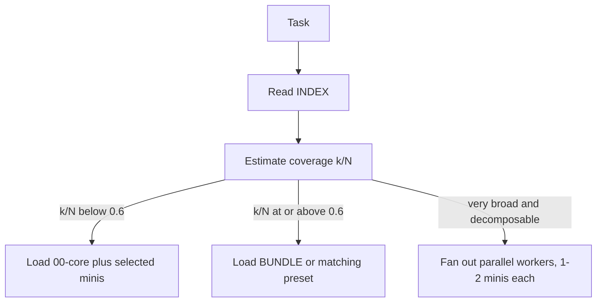

# Hive: a framework for building composable skills for AI agents

Hive is a framework for building composable skills for AI agents: a spec, a
CLI, a runtime loading policy, a library of skills built on it, and an
`npx` installer ([`hive-skills`](packages/hive-installer/)) that distributes
those skills into the AI coding clients you already use. It packages
an agent skill as many small, self-contained **minis** behind one
knowledge-free **INDEX**, plus a deterministic build step that compiles the
minis into a single **BUNDLE** or into task-shaped subsets (**presets**). At
load time a **coverage rule** decides whether a worker loads a few minis, the
whole bundle, or fans the work out across parallel worker agents that each
carry only what their slice needs. The aim is to load only the knowledge a
task needs, keep quality at least as high as a single monolithic skill, and
make every packaging decision auditable rather than implicit. Hive implements
the **CCS (Compiled Composable Skills) v1.0 specification**
([`docs/SPEC.md`](docs/SPEC.md)); the CLI is [`tools/hive.py`](tools/hive.py).
The name is a nod to collective-intelligence ideas, not a literal architecture.
Every claim the framework makes is checked against a benchmark suite rather
than asserted; that evidence lives in the Evidence section below and in full
in [`docs/BENCHMARKS.md`](docs/BENCHMARKS.md).

## Contents

- [Quick start](#quick-start)
- [The hypothesis](#the-hypothesis)
- [Why Hive exists](#why-hive-exists)
- [Evidence](#evidence)
- [The options](#the-options)
- [When to use it, and when not](#when-to-use-it-and-when-not)
- [Repo map](#repo-map)
- [Relationship to prior art](#relationship-to-prior-art)
- [Limitations & invitation to replicate](#limitations--invitation-to-replicate)
- [Provenance](#provenance)



## Quick start

**Install the skills into your AI tools (no clone needed):** run the installer
with `npx`. It scans for installed AI coding clients (Claude Code, Codex,
OpenCode, VS Code Copilot, Cline, Gemini, Windsurf, Cursor, and more), installs
the bundled CCS skills into the ones you pick, and can propose converting your
*existing* skills to CCS form. It backs up before every change, never edits a
client's rules file without explicit consent, and supports a zero-write
`--dry-run`.

```bash
npx hive-skills            # interactive wizard: scan → pick clients → pick skills → install
npx hive-skills scan       # just report detected clients and their current skills
npx hive-skills doctor     # diagnose install health and toolchain
npx hive-skills propose    # list conversion candidates with ready-to-run recipes
```

The installer's source lives in [`packages/hive-installer/`](packages/hive-installer/)
(published as `hive-skills`); see its [README](packages/hive-installer/README.md)
for the full command reference, client-support table, and safety model.

**The fast path (agentic; how most adopters should start):** point your AI
coding agent (Claude Code, Codex, anything that reads files) at
[`skills/meta/ccs-skill-creator/composable/INDEX.md`](skills/meta/ccs-skill-creator/composable/INDEX.md)
and ask it to create, convert, or update a skill. The meta-skill walks the agent
through the whole workflow, including running the verification commands below on
its own output.

**The manual path:** author a new skill with
[`docs/AUTHORING.md`](docs/AUTHORING.md); convert an existing one with
[`docs/CONVERSION.md`](docs/CONVERSION.md) (the one rule: repackaging, never
summarization). Then use the zero-dependency CLI:

```bash
python3 tools/hive.py compile skills/<category>/<domain>   # minis/ → BUNDLE.md (+ presets)
python3 tools/hive.py lint    skills/<category>/<domain>   # check index/mini/core rules
python3 tools/hive.py parity  skills/<category>/<domain> <source-dir>   # source vs union-of-minis
python3 tools/hive.py report  skills             # token/size/version summary across all skills, any depth
python3 tools/hive.py bump    skills/<category>/<domain> [major|minor|patch]   # bump composable/VERSION
```

`compile` regenerates artifacts (never hand-edit `BUNDLE.md` or `presets/*.md`);
`parity` is the gate that a conversion dropped no content; `lint` enforces the
structural rules in [`docs/SPEC.md`](docs/SPEC.md); `bump` is the only supported
way to change a skill's `composable/VERSION`.

## The hypothesis

Hive tests one claim: that packaging a skill as an index of
small, self-contained mini-skills, loadable in task-shaped configurations, beats
a monolithic skill on both quality and token efficiency, without the model losing
guidance that a single always-loaded document would have kept in front of it.

**What testing found: partially validated.** The direction holds where the
theory predicts and fails where the theory is weakest. Composable packaging met
or beat a monolithic file on quality and cut tokens 41–64% on narrow tasks that
touch only part of a skill's content. But the token advantage *inverts* on broad tasks
that need most of the skill's content (loading the index plus nearly every mini as
separate files costs more than one monolith), recovered only by compiling the
minis into a single bundle read in one shot. A lossy conversion that compressed
its source ~30% kept the token win but *lost* the quality edge, which is why
conversions are now gated on content parity. And for a skill carrying fewer than
roughly 5k tokens of content, the index-plus-core scaffolding costs more than
selective loading saves, so a small skill should stay a single file. The claim is real,
but it is a *conditional* win: it holds for large, trap-dense skills whose
tasks vary in what they need, and it is neutral-to-negative outside that band.

## Why Hive exists

The common ways to package a skill for an agent each have measurable failure
modes.

- **The monolith.** One always-loaded instruction file (an `AGENTS.md`, a big
  `SKILL.md`) pays its full token cost on *every* task, trivial or not, and
  suffers context-rot and lost-in-the-middle: in our round-1 experiment the
  monolithic condition had the *worst* mean rank of three conditions and fell up
  to 7 points below a no-skill baseline on broad tasks.
- **The unmeasured context file.** Guidance written without measuring its effect
  frequently *hurts*: independent studies of LLM-authored context files find
  slight success-rate drops and 14–22% more reasoning tokens. More guidance is
  not better guidance.
- **The progressive-disclosure tree.** A `SKILL.md` router over reference files
  the model reads one by one solves the always-loaded cost, but nothing
  guarantees the model picks the right files, and nothing compiles the common
  case into a single cheap read.

Hive's answer is a discipline, not a wish: load only the slice a task needs,
restate only what the model does not already know, compile the frequent
whole-skill case into one deterministic artifact, and prove every packaging
choice earns its cost against a benchmark. The evidence base is what separates
Hive from "write more guidance."

## Evidence

Every claim traces to `docs/BENCHMARKS.md` — ten experiments, one protocol:
tasks frozen by commit before the skills exist, blind judging against a fixed
rubric, deterministic token accounting, raw materials committed. Single-run
cells; treat directions as solid and magnitudes as indicative.

**What is proven:**

- **Quality**: composable packaging meets or beats a monolithic file (Exp 1)
  and holds parity with skills already hand-tuned for progressive disclosure
  (Exp 6–7) — confirmed independently on a community benchmark harness
  (Exp 9). Where knowledge sits outside model competence, skills beat
  no-skill by the widest margins in the suite (Exp 7: +5 to +7 points).
- **Tokens**: 41–64% file-level savings on narrow tasks (Exp 1); presets cut
  −53% vs the full bundle at parity (Exp 8); delivering small skills as one
  inlined bundle cuts −34–38% conversation tokens at parity in real harnesses
  (Exp 10 — the installer's automatic default since 0.2.0). At 195k-token
  scale, selective loading is the only feasible path, and its routing is
  measured-accurate (Exp 7, 10).

**What is not:**

- No quality *gain* over hand-tuned originals — parity, not superiority
  (Exp 7: originals won the head-to-head 4–1 within noise).
- Small skills (< ~5k tokens) should stay a single file — the scaffolding
  costs more than selection saves (Exp 6).
- In turn-based harnesses, runtime mini-navigation costs extra conversation
  turns at small/mid size — the reason delivery shape now matters (Exp 10).
- Index edge metadata (Exp 5) and premium-model shard routing (Exp 4, 8)
  showed no measured benefit.

Skill tokens loaded per narrow-task cell, original packaging vs Hive
selective loading:

| Skill | Original packaging (tokens) | Hive selective load (tokens) | Tokens saved |
|---|---|---|---|
| code-review | 4,197 | 1,516 | `█████████████░░░░░░░` 64% |
| tech-writing | 4,298 | 2,090 | `██████████░░░░░░░░░░` 51% |
| data-analysis | 4,176 | 2,444 | `████████░░░░░░░░░░░░` 41% |
| python-api | 4,702 | 2,483 | `█████████░░░░░░░░░░░` 47% |
| financial-analyst | 4,833 | 2,299 | `██████████░░░░░░░░░░` 52% |
| pdf | 14,309 | 3,995 | `██████████████░░░░░░` 72% |

Full methodology, per-experiment tables, and every loss:
[`docs/BENCHMARKS.md`](docs/BENCHMARKS.md).

## The options

Hive offers a small menu of packaging tricks, each with a distinct
evidence status. An author picks the ones a skill warrants; a loading agent
picks the one a task warrants at runtime (the coverage rule, §10 of the spec).

- **Selective mini loading (narrow path).** Read the INDEX, load `00-core` plus
  only the minis a task needs. *Evidence: strong at scale; conditional below it.*
  41–64% file-level token savings (mean
  ~51%) at equal-or-better quality on narrow tasks; selection was expert-grade in
  all but 1 of 8 round-1 runs.
- **Compiled bundle (broad path).** When most of a skill's content is relevant,
  load one concatenated `BUNDLE.md` in a single read instead of many files. *Evidence:
  strong.* Beat loose-mini loading 4–0 on broad tasks and had the best mean rank
  of four conditions: one file op, zero selection risk. Costs +8–22% tokens vs a
  hand monolith (the self-containment redundancy), narrowable by dedup into
  `00-core`.
- **Presets (variant tracks).** Named compiled subsets for recurring
  configurations, including *mutually-exclusive tracks* (e.g. a Python vs a Node
  server preset) so the broad path can load one track instead of the whole
  bundle. *Evidence: measured: −53% tokens vs bundle at parity quality (Exp 8).*
  Experiment 6 exposed the bundle over-loading a Python task with Node reference
  material and projected a language preset would cut that ~28%, quality untested
  at the time. Experiment 8 measured a language-specific preset directly: it
  loaded 11,326 tokens, −53% vs the full bundle (24,067) and −28% vs the
  original hand-tuned packaging (15,797), at quality parity with the bundle (34
  vs 35 of 40, within noise). The hand-tuned original still won on quality (37).
- **Subagent fan-out (routed path).** For a very broad task that decomposes along
  module boundaries, an orchestrator fans out parallel workers, each loading 1–2
  minis, then synthesizes. *Evidence: quality-neutral, cost-positive.* Matched
  single-context quality within noise while cutting max per-context load to
  ~2,900 tokens vs 7–9k.
- **Per-mini model-hint / effort-hint routing (MAY).** A mini may carry
  frontmatter advising which model tier / reasoning effort a shard loading it
  warrants, so fan-out can run a premium model only on the hardest shard.
  *Evidence: cost-shaping shown, quality gain unproven.* The routed run shaped
  cost and parallelized wall-clock, but a ceiling effect on the tested task meant
  the premium-model shard's quality advantage could not express itself. A second,
  harder test (Exp 8, a deliberately engineered-hard valuation shard) again found
  the mid-tier model matching the premium model exactly, so the quality-gain case
  remains unproven. See [`docs/MODEL-ROUTING.md`](docs/MODEL-ROUTING.md) for the
  full guide.
- **Measured delivery shapes (the installer's edge).** The same compiled
  artifacts can be *delivered* differently per client, and Experiment 10
  measured which shape wins where in real installed harnesses: bundle-inline
  for skills ≤~25k tokens (−34–38% conversation tokens at quality parity on
  Claude Code; outscored the thin-shim tree 4/4 vs 3/4 on Codex), the
  composable tree for large skills (where selective loading is the only
  physically possible path — and its INDEX routing measured accurate),
  presets for recurring tracks. `npx hive-skills` applies these defaults
  automatically since 0.2.0. *Evidence: measured (Exp 10, 2 skills × 2
  harnesses × n=3); the 10–25k inline band is provisional pending Exp 11.*
  No monolithic skill can make this choice at all — there is only one shape
  to deliver.
- **Per-mini and per-skill versioning (new).** A mini MAY carry a `version:`
  frontmatter key and a skill MAY carry a `composable/VERSION` file, both bare
  semver (`X.Y.Z`); `hive.py bump` is the supported mutator for the skill-level
  file, and `report` surfaces a version column. *Evidence: convention.* This is
  metadata for humans and future tooling; it is not wired into loading behavior
  and makes no quality claim.

## When to use it, and when not

Use Hive when **both** hold:

- The skill carries **more than roughly 5k tokens of non-inferable, trap-dense
  content**: specific procedures, thresholds, easy-to-miss failure modes the
  model won't apply unprompted.
- **Tasks vary in which subtopics they need**, so selective loading has something
  to select.

Do **not** use Hive when:

- The skill is **small** (< ~5k tokens). The INDEX + 00-core scaffolding costs
  more than selective loading saves; a single `SKILL.md` is the right packaging
  (Experiment 6).
- The knowledge is something **a frontier model already does well**. Generic
  guidance adds tokens and steps without adding quality; the no-skill baseline
  repeatedly tied or beat skill conditions on tasks inside model competence.
- Every task needs **all** of the skill. Then it's one document; just ship the
  bundle.

## Repo map

- **[`docs/SPEC.md`](docs/SPEC.md)**: normative CCS v1.0 spec; every rule
  annotated with the measurement that motivates it (or marked convention).
- **[`docs/AUTHORING.md`](docs/AUTHORING.md)** /
  **[`docs/CONVERSION.md`](docs/CONVERSION.md)**: practical guides for new and
  existing skills.
- **[`docs/BENCHMARKS.md`](docs/BENCHMARKS.md)**: all seven experiments,
  methodology, reproduction pointers, and limitations.
- **[`tools/hive.py`](tools/hive.py)**: the `compile` / `lint` / `parity` /
  `report` / `bump` CLI (stdlib only).
- **[`packages/hive-installer/`](packages/hive-installer/)**: the `hive-skills`
  npm package — an `npx`-runnable installer that detects AI coding clients,
  installs the bundled skills into them, proposes conversions, and provides
  doctor/backup/restore. TypeScript, Node ≥ 18; bundles the skills and
  `tools/hive.py` into a self-contained tarball.
- **`skills/`**: thirteen skills in a categorized layout, cataloged in
  [`skills/README.md`](skills/README.md). `skills/authored/` (code-review,
  data-analysis, financial-analysis, python-api, tech-writing) are written
  directly in CCS form; `skills/converted/` (claude-api, docx, internal-comms,
  mcp-builder, pdf, pptx, skill-creator) are ported from upstream skills; and
  `skills/meta/ccs-skill-creator` is the agentic entry point for
  authoring/converting skills.
- **`benchmarks/`**: raw tasks, worker outputs, blinding maps, judge scores, and
  token accounting: `exp1-2/` (monolithic vs composable, and the compiled-bundle
  rejudge), `exp3-4/` (market-skill conversion and the routing probe), `exp5/`
  (the skill-graph edge probe), `exp6/` (the official-skill supplemental
  validation), `exp7/` (three of Hive's own converted skills head-to-head with
  their original Anthropic packaging), and `adoption-test/` (the agentic
  meta-skill exercised against this repo).
- **`skills/sources/`**: vendored third-party source material (see provenance below).
- **`research/`**: landscape and positioning research
  ([`POSITIONING-RESEARCH.md`](research/POSITIONING-RESEARCH.md)) and the failure-
  mode survey ([`RESEARCH.md`](research/RESEARCH.md)).

## Relationship to prior art

Hive recombines pieces that exist elsewhere. Anthropic Agent Skills already
implement progressive disclosure (a
`SKILL.md` router over `reference/*.md` files ≈ our INDEX over minis); Cursor
`.cursor/rules` and GitHub Copilot `*.instructions.md` encode always-on vs
auto-attached vs model-requested loading; `llms.txt`/`llms-full.txt` mirror INDEX
+ BUNDLE; DSPy and software linkers/tree-shaking supply the "authored modules →
compile step → one artifact" shape; DITA (topics + ditamaps + conditional
profiles) is the deepest non-AI analog. What no mainstream system combines is
**(index + minis + core) plus a compiled bundle with presets plus an explicit
runtime coverage threshold**. The deterministic compile step and the "≥ ~60%
relevant → load the bundle, else load minis, else fan out" policy are the
genuinely novel parts. The full landscape scan, including gaps Hive still lacks
(trigger metadata, a per-mini eval harness) and over-engineering traps it
deliberately avoids, is in
[`research/POSITIONING-RESEARCH.md`](research/POSITIONING-RESEARCH.md).

## Limitations & invitation to replicate

The evidence base is honest about its size. Every benchmark cell is **single-run**
(n=1 per task/condition); score gaps ≤ 3 points are within judge noise, and
independent re-judging shifted some rankings by ±1. All results come from **one
model family** (mid-tier LLM workers, frontier-tier LLM judges and authors, with
frontier-tier workers in Experiment 6). Token counts are chars/4 approximations,
applied identically to all conditions so ratios are robust but absolutes are
estimates. Edges and routing are under-tested, and the Experiment 6 preset remedy
is a token projection that was not re-benchmarked. These are directional
findings, not settled numbers. **Replication on other model families, larger
domain sets, and repeated sampling is explicitly welcome**: the raw tasks,
outputs, blinding maps, and judge scores are all committed under `benchmarks/` so
the experiments can be re-run and the claims checked or overturned.

## Provenance

Content under `skills/sources/` is third-party material vendored **unmodified** for
research and benchmarking, with original licenses and `PROVENANCE.md` retained.
This includes the official Anthropic Agent Skills used in Experiment 6
(`mcp-builder`, `internal-comms`) and Experiment 7 (`claude-api`, `pdf`, `pptx`),
all from [`anthropics/skills`](https://github.com/anthropics/skills), and the
`financial-analyst` skill from `alirezarezvani/claude-skills` used in Experiment
3. The Hive conversions of these skills live under `skills/` and are derived
works; see each skill's provenance note. All benchmark claims in this repository
trace to a table in `docs/BENCHMARKS.md` or are labeled convention.
