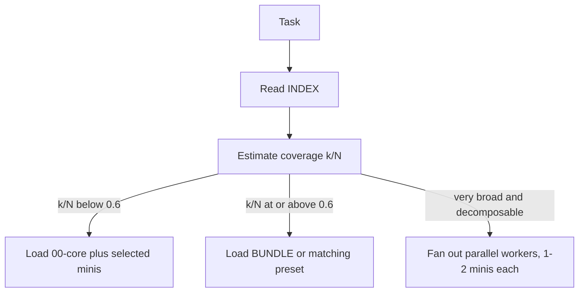

# Hive: a framework for building composable skills for AI agents

Hive is a framework for building composable skills for AI agents: a spec, a
CLI, a runtime loading policy, and a library of skills built on it. It packages
an agent skill as many small, self-contained **minis** behind one
knowledge-free **INDEX**, plus a deterministic build step that compiles the
minis into a single **BUNDLE** or into task-shaped subsets (**presets**). At
load time a **coverage rule** decides whether a worker loads a few minis, the
whole bundle, or fans the work out across parallel worker agents that each
carry only what their slice needs. The aim is to load only the knowledge a
task needs, keep quality at least as high as a single monolithic skill, and
make every packaging decision auditable rather than implicit. Hive implements
the **CCS (Compiled Composable Skills) v1.0 specification**
([`docs/SPEC.md`](docs/SPEC.md)); the CLI is [`tools/hive.py`](tools/hive.py).
The name is a nod to collective-intelligence ideas, not a literal architecture.
Every claim the framework makes is checked against a benchmark suite rather
than asserted; that evidence lives in the Evidence section below and in full
in [`docs/BENCHMARKS.md`](docs/BENCHMARKS.md).

## Contents

- [The hypothesis](#the-hypothesis)
- [Why Hive exists](#why-hive-exists)
- [Evidence](#evidence)
- [The options](#the-options)
- [When to use it, and when not](#when-to-use-it-and-when-not)
- [Quick start](#quick-start)
- [Repo map](#repo-map)
- [Relationship to prior art](#relationship-to-prior-art)
- [Limitations & invitation to replicate](#limitations--invitation-to-replicate)
- [Provenance](#provenance)



## The hypothesis

Hive tests one claim: that packaging a skill as an index of
small, self-contained mini-skills, loadable in task-shaped configurations, beats
a monolithic skill on both quality and token efficiency, without the model losing
guidance that a single always-loaded document would have kept in front of it.

**What testing found: partially validated.** The direction holds where the
theory predicts and fails where the theory is weakest. Composable packaging met
or beat a monolithic file on quality and cut tokens 41–64% on narrow tasks that
touch only part of a skill's content. But the token advantage *inverts* on broad tasks
that need most of the skill's content (loading the index plus nearly every mini as
separate files costs more than one monolith), recovered only by compiling the
minis into a single bundle read in one shot. A lossy conversion that compressed
its source ~30% kept the token win but *lost* the quality edge, which is why
conversions are now gated on content parity. And for a skill carrying fewer than
roughly 5k tokens of content, the index-plus-core scaffolding costs more than
selective loading saves, so a small skill should stay a single file. The claim is real,
but it is a *conditional* win: it holds for large, trap-dense skills whose
tasks vary in what they need, and it is neutral-to-negative outside that band.

## Why Hive exists

The common ways to package a skill for an agent each have measurable failure
modes.

- **The monolith.** One always-loaded instruction file (an `AGENTS.md`, a big
  `SKILL.md`) pays its full token cost on *every* task, trivial or not, and
  suffers context-rot and lost-in-the-middle: in our round-1 experiment the
  monolithic condition had the *worst* mean rank of three conditions and fell up
  to 7 points below a no-skill baseline on broad tasks.
- **The unmeasured context file.** Guidance written without measuring its effect
  frequently *hurts*: independent studies of LLM-authored context files find
  slight success-rate drops and 14–22% more reasoning tokens. More guidance is
  not better guidance.
- **The progressive-disclosure tree.** A `SKILL.md` router over reference files
  the model reads one by one solves the always-loaded cost, but nothing
  guarantees the model picks the right files, and nothing compiles the common
  case into a single cheap read.

Hive's answer is a discipline, not a wish: load only the slice a task needs,
restate only what the model does not already know, compile the frequent
whole-skill case into one deterministic artifact, and prove every packaging
choice earns its cost against a benchmark. The evidence base is what separates
Hive from "write more guidance."

## Evidence

Every claim below traces to a benchmark table in
[`docs/BENCHMARKS.md`](docs/BENCHMARKS.md). The protocol is the same throughout:
tasks frozen by commit *before* the skills exist (no tailoring in either
direction), blind judging by independent frontier-tier LLM judges against a
fixed rubric, deterministic token accounting (chars/4 of files actually loaded),
and orchestrator verification of code outputs. This is a study of moderate
confidence: single-run cells, one model family. **Treat directions as solid and
magnitudes as indicative** (score gaps ≤ 3 points are within judge noise).

Two results from Experiment 7 carry the most weight for real adopters. First,
**scale**: the `claude-api` skill is ~195k tokens, far too large to load whole
into any context, yet on a broad multi-file build the Hive conversion navigated
it to a **38 vs 34** win over the original packaging *at lower token cost*, and
on a narrow task it pulled just **7 of 56 minis** for the slice the task needed.
Second, **external knowledge**: when a domain sits genuinely outside model
competence (current SDK internals, PDF and PPTX tooling), packaging it beat the
no-skill baseline by the **widest margins in the whole suite** (+5 to +7 mean
points), the counter-case to the ceiling effect that flattens skill gains on
knowledge the model already has.

**Token savings on narrow tasks, at a glance.** Skill tokens loaded per narrow
task, original/monolithic packaging vs Hive selective loading, across every
domain measured:

```mermaid
xychart-beta
    title "Skill tokens loaded per narrow task: original packaging vs Hive"
    x-axis ["code-review", "tech-writing", "data-analysis", "python-api", "financial-analyst", "pdf"]
    y-axis "Skill tokens" 0 --> 15000
    bar [4197, 4298, 4176, 4702, 4833, 14309]
    bar [1516, 2090, 2444, 2483, 2299, 3995]
```



Bars left to right in each pair: original/monolithic packaging, then Hive
selective loading. The y-axis starts at zero. These are the **narrow-task**
cells only, the ones selective loading is built for; see
[`docs/BENCHMARKS.md`](docs/BENCHMARKS.md) for the full tables, including the
**broad-task** cells where the token advantage shrinks or inverts.

| # | What it tested | Result | Where Hive lost / its limit |
|---|----------------|--------|-----------------------------|
| 1 | Monolithic vs composable vs no-skill, 4 domains × 2 task types | Composable ≥ monolithic quality (5–3 head-to-head); 41–64% token savings on narrow tasks | Token advantage **inverts** on broad tasks (+2% to +27%); no-skill baseline tied composable and beat the monolith |
| 2 | Loading the compiled bundle in one read (condition D) | Bundle beat loose-mini loading **4–0** on broad tasks; best mean rank of four conditions | Bundle costs +8–22% tokens vs a hand monolith (self-containment redundancy) |
| 3 | Converting a third-party market skill (financial-analyst) | Token savings transferred (−52% narrow, −23% broad) | **Lossy** conversion (~30% compression) cost the quality edge; original won both tasks. Fix: lossless parity gate |
| 4 | Per-mini model routing / fan-out (condition E) | Matched single-context quality within noise; max per-context load ~2,900 vs 7–9k tokens | Quality gain unproven; ceiling effect meant the premium-model shard couldn't show its edge |
| 5 | Skill-graph edges (requires:/pairs-with:) | Flat index hit all 5 pre-registered target minis in both conditions | No selection or application benefit; mild precision cost. Edges not justified at domain scale |
| 6 | Two official Anthropic Agent Skills, converted losslessly | Large skill, narrow task: Hive best quality **and** −11% tokens | Broad task: the bundle over-loaded (24k tok incl. irrelevant Node ref) vs pruned manual disclosure (16k) and lost 36→32.5; small (~2.8k tok) skill got no benefit at all |
| 7 | Three of Hive's own converted skills (claude-api, pdf, pptx) head-to-head with their original Anthropic packaging | Skills beat no-skill by the suite's widest margins (+5 to +7 mean points); Hive took the hardest cell (claude-api broad, a 195k-token skill) **38 vs 34** at −4% tokens, and cut pdf-narrow **−72%** tokens | Original hand-tuned packaging won overall **4–1** (mean 36.17 vs 34.50, within noise); Hive reaches quality *parity*, not a quality gain, on skills already built for progressive disclosure |

In summary: **Hive wins where there is a large body of trap-dense
knowledge and a task needs only part of it.** It is neutral-to-negative on small
skills, on knowledge the model already has, and (until you ship presets) on
broad tasks over a skill that contains mutually-exclusive tracks (Experiment 6's
Python vs Node "preset gap"; remedy compiled but not re-benchmarked). Against a
skill that is *already* hand-tuned for progressive disclosure, Hive reaches
quality parity, not a quality gain (Experiment 7: the original packaging held a
within-noise edge and won the head-to-head 4–1, mean 36.17 vs 34.50); Hive's
advantage there is economics, scale navigation, and one uniform loading policy
with versioning and lint/parity tooling, not higher scores. Edge metadata and
model-routing quality gains are explicitly **not** proven.

## The options

Hive offers a small menu of packaging tricks, each with a distinct
evidence status. An author picks the ones a skill warrants; a loading agent
picks the one a task warrants at runtime (the coverage rule, §10 of the spec).

- **Selective mini loading (narrow path).** Read the INDEX, load `00-core` plus
  only the minis a task needs. *Evidence: strong.* 41–64% token savings (mean
  ~51%) at equal-or-better quality on narrow tasks; selection was expert-grade in
  all but 1 of 8 round-1 runs.
- **Compiled bundle (broad path).** When most of a skill's content is relevant,
  load one concatenated `BUNDLE.md` in a single read instead of many files. *Evidence:
  strong.* Beat loose-mini loading 4–0 on broad tasks and had the best mean rank
  of four conditions: one file op, zero selection risk. Costs +8–22% tokens vs a
  hand monolith (the self-containment redundancy), narrowable by dedup into
  `00-core`.
- **Presets (variant tracks).** Named compiled subsets for recurring
  configurations, including *mutually-exclusive tracks* (e.g. a Python vs a Node
  server preset) so the broad path can load one track instead of the whole
  bundle. *Evidence: motivated, not re-benchmarked.* Experiment 6 exposed the
  bundle over-loading a Python task with Node reference material; a language
  preset would have cut that ~28% (a deterministic token projection, quality
  untested).
- **Subagent fan-out (routed path).** For a very broad task that decomposes along
  module boundaries, an orchestrator fans out parallel workers, each loading 1–2
  minis, then synthesizes. *Evidence: quality-neutral, cost-positive.* Matched
  single-context quality within noise while cutting max per-context load to
  ~2,900 tokens vs 7–9k.
- **Per-mini model-hint / effort-hint routing (MAY).** A mini may carry
  frontmatter advising which model tier / reasoning effort a shard loading it
  warrants, so fan-out can run a premium model only on the hardest shard.
  *Evidence: cost-shaping shown, quality gain unproven.* The routed run shaped
  cost and parallelized wall-clock, but a ceiling effect on the tested task meant
  the premium-model shard's quality advantage could not express itself. See
  [`docs/MODEL-ROUTING.md`](docs/MODEL-ROUTING.md) for the full guide.
- **Per-mini and per-skill versioning (new).** A mini MAY carry a `version:`
  frontmatter key and a skill MAY carry a `composable/VERSION` file, both bare
  semver (`X.Y.Z`); `hive.py bump` is the supported mutator for the skill-level
  file, and `report` surfaces a version column. *Evidence: convention.* This is
  metadata for humans and future tooling; it is not wired into loading behavior
  and makes no quality claim.

## When to use it, and when not

Use Hive when **both** hold:

- The skill carries **more than roughly 5k tokens of non-inferable, trap-dense
  content**: specific procedures, thresholds, easy-to-miss failure modes the
  model won't apply unprompted.
- **Tasks vary in which subtopics they need**, so selective loading has something
  to select.

Do **not** use Hive when:

- The skill is **small** (< ~5k tokens). The INDEX + 00-core scaffolding costs
  more than selective loading saves; a single `SKILL.md` is the right packaging
  (Experiment 6).
- The knowledge is something **a frontier model already does well**. Generic
  guidance adds tokens and steps without adding quality; the no-skill baseline
  repeatedly tied or beat skill conditions on tasks inside model competence.
- Every task needs **all** of the skill. Then it's one document; just ship the
  bundle.

## Quick start

**The fast path (agentic; how most adopters should start):** point your AI
coding agent (Claude Code, Codex, anything that reads files) at
[`skills/meta/ccs-skill-creator/composable/INDEX.md`](skills/meta/ccs-skill-creator/composable/INDEX.md)
and ask it to create, convert, or update a skill. The meta-skill walks the agent
through the whole workflow, including running the verification commands below on
its own output.

**The manual path:** author a new skill with
[`docs/AUTHORING.md`](docs/AUTHORING.md); convert an existing one with
[`docs/CONVERSION.md`](docs/CONVERSION.md) (the one rule: repackaging, never
summarization). Then use the zero-dependency CLI:

```bash
python3 tools/hive.py compile skills/<category>/<domain>   # minis/ → BUNDLE.md (+ presets)
python3 tools/hive.py lint    skills/<category>/<domain>   # check index/mini/core rules
python3 tools/hive.py parity  skills/<category>/<domain> <source-dir>   # source vs union-of-minis
python3 tools/hive.py report  skills             # token/size/version summary across all skills, any depth
python3 tools/hive.py bump    skills/<category>/<domain> [major|minor|patch]   # bump composable/VERSION
```

`compile` regenerates artifacts (never hand-edit `BUNDLE.md` or `presets/*.md`);
`parity` is the gate that a conversion dropped no content; `lint` enforces the
structural rules in [`docs/SPEC.md`](docs/SPEC.md); `bump` is the only supported
way to change a skill's `composable/VERSION`.

## Repo map

- **[`docs/SPEC.md`](docs/SPEC.md)**: normative CCS v1.0 spec; every rule
  annotated with the measurement that motivates it (or marked convention).
- **[`docs/AUTHORING.md`](docs/AUTHORING.md)** /
  **[`docs/CONVERSION.md`](docs/CONVERSION.md)**: practical guides for new and
  existing skills.
- **[`docs/BENCHMARKS.md`](docs/BENCHMARKS.md)**: all seven experiments,
  methodology, reproduction pointers, and limitations.
- **[`tools/hive.py`](tools/hive.py)**: the `compile` / `lint` / `parity` /
  `report` / `bump` CLI (stdlib only).
- **`skills/`**: thirteen skills in a categorized layout, cataloged in
  [`skills/README.md`](skills/README.md). `skills/authored/` (code-review,
  data-analysis, financial-analysis, python-api, tech-writing) are written
  directly in CCS form; `skills/converted/` (claude-api, docx, internal-comms,
  mcp-builder, pdf, pptx, skill-creator) are ported from upstream skills; and
  `skills/meta/ccs-skill-creator` is the agentic entry point for
  authoring/converting skills.
- **`benchmarks/`**: raw tasks, worker outputs, blinding maps, judge scores, and
  token accounting: `exp1-2/` (monolithic vs composable, and the compiled-bundle
  rejudge), `exp3-4/` (market-skill conversion and the routing probe), `exp5/`
  (the skill-graph edge probe), `exp6/` (the official-skill supplemental
  validation), `exp7/` (three of Hive's own converted skills head-to-head with
  their original Anthropic packaging), and `adoption-test/` (the agentic
  meta-skill exercised against this repo).
- **`skills/sources/`**: vendored third-party source material (see provenance below).
- **`research/`**: landscape and positioning research
  ([`POSITIONING-RESEARCH.md`](research/POSITIONING-RESEARCH.md)) and the failure-
  mode survey ([`RESEARCH.md`](research/RESEARCH.md)).

## Relationship to prior art

Hive recombines pieces that exist elsewhere. Anthropic Agent Skills already
implement progressive disclosure (a
`SKILL.md` router over `reference/*.md` files ≈ our INDEX over minis); Cursor
`.cursor/rules` and GitHub Copilot `*.instructions.md` encode always-on vs
auto-attached vs model-requested loading; `llms.txt`/`llms-full.txt` mirror INDEX
+ BUNDLE; DSPy and software linkers/tree-shaking supply the "authored modules →
compile step → one artifact" shape; DITA (topics + ditamaps + conditional
profiles) is the deepest non-AI analog. What no mainstream system combines is
**(index + minis + core) plus a compiled bundle with presets plus an explicit
runtime coverage threshold**. The deterministic compile step and the "≥ ~60%
relevant → load the bundle, else load minis, else fan out" policy are the
genuinely novel parts. The full landscape scan, including gaps Hive still lacks
(trigger metadata, a per-mini eval harness) and over-engineering traps it
deliberately avoids, is in
[`research/POSITIONING-RESEARCH.md`](research/POSITIONING-RESEARCH.md).

## Limitations & invitation to replicate

The evidence base is honest about its size. Every benchmark cell is **single-run**
(n=1 per task/condition); score gaps ≤ 3 points are within judge noise, and
independent re-judging shifted some rankings by ±1. All results come from **one
model family** (mid-tier LLM workers, frontier-tier LLM judges and authors, with
frontier-tier workers in Experiment 6). Token counts are chars/4 approximations,
applied identically to all conditions so ratios are robust but absolutes are
estimates. Edges and routing are under-tested, and the Experiment 6 preset remedy
is a token projection that was not re-benchmarked. These are directional
findings, not settled numbers. **Replication on other model families, larger
domain sets, and repeated sampling is explicitly welcome**: the raw tasks,
outputs, blinding maps, and judge scores are all committed under `benchmarks/` so
the experiments can be re-run and the claims checked or overturned.

## Provenance

Content under `skills/sources/` is third-party material vendored **unmodified** for
research and benchmarking, with original licenses and `PROVENANCE.md` retained.
This includes the official Anthropic Agent Skills used in Experiment 6
(`mcp-builder`, `internal-comms`) and Experiment 7 (`claude-api`, `pdf`, `pptx`),
all from [`anthropics/skills`](https://github.com/anthropics/skills), and the
`financial-analyst` skill from `alirezarezvani/claude-skills` used in Experiment
3. The Hive conversions of these skills live under `skills/` and are derived
works; see each skill's provenance note. All benchmark claims in this repository
trace to a table in `docs/BENCHMARKS.md` or are labeled convention.
