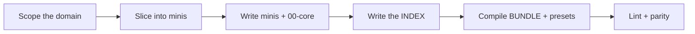

# Authoring a CCS Skill from Scratch

A practical guide to writing a *new* Compiled Composable Skill. For the
normative rules see `SPEC.md`; for converting an existing skill see
`CONVERSION.md`. The running example is the `code-review` skill in
`skills/authored/code-review/composable/`. (Per `SPEC.md` §2.1.1, a skills root
MAY organize skills into category subdirectories like `authored/`, `converted/`,
`meta/`; the per-skill `composable/` contract is the same either way.)

The author flow is:



---

## 1. First decide whether to write a skill at all

Skills cost tokens on every load and can *hurt* when their content is something
the model already does well. Write a skill only when both hold:

- **The knowledge is trap-dense and judgment-heavy**: non-obvious decisions,
  easy-to-miss failure modes, domain conventions the model won't spontaneously
  apply. In the experiments, skill content moved scores *only* where tasks had
  planted traps (a duplicate-row data-quality bug; a causal-inference bait that
  led a baseline to tell a VP real growth was a data artifact). On tasks inside
  the model's competence, the no-skill baseline tied the best skill condition
  and beat the monolith.
- **The knowledge is non-inferable**: specific procedures, thresholds, or
  gotchas, not a restatement of what a frontier model would produce anyway.
  Restating inferable knowledge measurably adds tokens and steps without adding
  quality.

If the domain is standard and the model handles it well, **do not write a
skill.** If only part of it is trap-dense, write minis for that part and
skip the rest.

**Litmus test:** for each candidate piece of guidance, ask "would a strong model
reliably do this unprompted?" If yes, cut it. What remains (the traps and the
non-obvious calls) is your skill.

---

## 2. Scope the domain

Define the skill as one coherent domain a practitioner would recognize
("code review", "financial analysis"), broad enough to have several subtopics
but narrow enough that any one task touches only some of them. The coverage
rule only pays off when tasks vary in which subtopics they need; a skill where
every task needs everything should just be one document (its bundle).

Write down, before slicing:

- The **subtopics** a practitioner distinguishes.
- The **cross-cutting traps** that apply regardless of subtopic; these become
  `00-core`.
- A few **representative tasks**, spanning narrow (one subtopic) to broad
  (most subtopics). You will sanity-check your slicing against these.

For code-review the subtopics were: review method, security, correctness,
concurrency, error handling, performance, API design, tests, refactoring &
communication. The cross-cutting trap ("read with a threat model, reproduce
before you report, prioritize by impact") went into the method mini, which the
index marks *load at the start of any review*.

---

## 3. Slice the minis

One mini = one subtopic. Aim for roughly 6–12 minis per skill. Guidelines:

- **One subtopic per mini, focused.** If a mini covers two things a task might
  want separately, split it. If two minis are never useful apart, merge them.
  Code-review merged "refactoring" and "communication" into `09` because a
  reviewer writing up findings does both together, but kept `security` and
  `correctness` separate because many reviews want one without the other.
- **Self-contained.** Each mini must be applicable from its own text plus
  `00-core`. Do not write "as covered in the performance mini…"; restate the
  little that's needed. This is the deliberate redundancy that makes selective
  loading safe: a task that loads only `02-security` must not be missing a rule
  that lives in `04-concurrency`.
- **Size follows content, not a budget.** Typical minis run ~300–700 words.
  Longer is fine when the subtopic demands it. **Never thin content to hit a
  size.** The one time an author decomposed a skill against word budgets, the
  compressed detail was exactly what judges rewarded, and quality dropped 3–4
  points. Save tokens by *selection*, never by *summarizing*.
- **Order for loading.** Number minis `NN-topic.md`. Put the "start here"
  method mini first; group related subtopics adjacently. The ordinal drives
  index and bundle order.

Sanity-check against your representative tasks: for each, list which minis it
should load. If a task needs a rule that doesn't fall cleanly into one mini, you
have a boundary problem: re-slice.

---

## 4. Write the `00-core` mini (if warranted)

`00-core` carries only cross-cutting traps: guidance relevant more often than a
task-scoped reader would guess, which you don't want to depend on selection to
pull in. Classic contents: data-quality / input-validation discipline, "prove
it before you claim it", "present ranges not points."

Rules of thumb:

- **Keep it small**: it is paid on every load, like the index. The validated
  cores were ~600–700 tokens. It states the cross-cutting rule and points to the
  focused mini for depth; it does not reproduce a subtopic.
- **Only include what's genuinely cross-cutting.** If guidance belongs to one
  subtopic, it goes in that subtopic's mini, not core.
- **Mark it always-load in the index.** The single selection miss observed
  across 8 runs was a cross-cutting concern (data quality) left as an optional
  mini and skipped; `00-core` fixes that class of miss by construction.

If the skill has no genuinely cross-cutting traps, you may omit `00-core`
(code-review folds its cross-cutting method into the always-load `01` mini
instead; either pattern is fine, as long as the always-load guidance exists).

---

## 5. Write the INDEX

The index is a **knowledge-free menu**: it tells the reader what each mini is and
when to load it, and carries no knowledge a mini needs to be applied. Keep it
under ~200 words. One line per mini, each with:

1. the filename,
2. a terse content descriptor (the nouns a task would match on),
3. a **"load when"** hint phrased as an *observable task condition*.

The "load when" hint is the load-bearing part; expert-grade selection in the
experiments is attributed to these hints. Phrase them as conditions the loader
can check against the task, not as topic restatements:

Good (from code-review):

```
- `02-security-review.md` - Injection, path traversal, secrets, crypto, authz/IDOR, SSRF. Load when code touches input, storage, or external systems.
- `04-concurrency.md` - Races, shared state, deadlocks, async, TOCTOU. Load when code is threaded, async, or shares state.
```

Weak (avoid): "`04-concurrency.md` - About concurrency." (no trigger; forces the
loader to infer relevance from the topic word alone).

Mark the always-load mini explicitly:

```
Load `mini/00-core.md` **always**. Load others on demand per the task.
- `mini/00-core.md` - analyst method, data validation, cross-cutting traps - **always load**
```

---

## 6. Compile the artifacts

Run the build tool to generate `BUNDLE.md` and any presets. Never hand-write
them:

```bash
python3 tools/hive.py compile skills/<category>/<domain>   # minis/ → BUNDLE.md (+ presets)
python3 tools/hive.py lint    skills/<category>/<domain>   # structural rules from SPEC.md
```

The bundle is the deterministic concatenation of every mini in index
order, with `00-core` first and a `<!-- module: NN-name.md -->` marker before
each mini's body. Presets are named subsets for recurring tasks
(e.g. `security-audit` = 00-core + 02-security) built by the same rules.

Only add a preset for a configuration that real tasks actually hit. Do not
generate a combinatorial family of presets speculatively.

Run the **parity diff**: the union of your minis (i.e. the bundle) must be
content-equivalent to your intended coverage: nothing dropped, nothing
summarized away. For a from-scratch skill this mainly guards against
accidentally leaving a subtopic only in your notes.

**Versioning your skill (optional).** You may drop a `composable/VERSION` file
holding a bare semver string (`X.Y.Z`) to version the skill as a whole; `compile`
stamps it into the bundle title and `report` shows it in a `version` column. Use
`python3 tools/hive.py bump skills/<category>/<domain> [major|minor|patch]` to change it;
that is the only supported mutator (it creates the file at `0.1.0` if absent).
Individual minis may also carry a `version:` frontmatter key. Both are convention
(metadata for humans and tooling); neither affects how the skill loads. See
`SPEC.md` §11 (Versioning).

---

## 7. Worked example: `code-review`

1. **Should it exist?** Code review is trap-dense (IDOR, TOCTOU, mutable default
   args, N+1) and judgment-heavy (severity triage). Yes, with a caveat: on a
   routine review inside model competence a skill adds little; this
   skill earns its cost on the trap-dense cases.
2. **Scope.** Domain = reviewing a diff for defects and communicating them.
   Subtopics enumerated in §2.
3. **Slice.** Nine minis, `01`–`09`. `01-review-method` is the always-load
   "start here" mini carrying the cross-cutting method (threat model, passes,
   prioritize by impact, reproduce before reporting). `02`–`08` are the defect
   categories, one per mini. `09` merges refactoring with severity-triage and
   feedback because they co-occur when writing up.
4. **Core.** No separate `00-core`; the cross-cutting method lives in `01`,
   marked *load at the start of any review*.
5. **Index.** Nine lines, each a descriptor + "load when" condition (see §5).
   Under 200 words, knowledge-free.
6. **Compile.** `BUNDLE.md` concatenates `01`–`09` with module markers; a
   `security-audit` preset could be `01` + `02`.
7. **Check against tasks.** Narrow "review this auth endpoint" → loads
   {01, 02}, correctly skipping performance/concurrency. Broad "full review" →
   coverage ≥ 0.6 → load the bundle in one read. Both behaviors match the
   measured expert selection.

---

## 8. Authoring checklist

- [ ] The knowledge is trap-dense, judgment-heavy, and non-inferable, not a
      restatement of what the model already does well.
- [ ] Domain is one coherent area whose tasks vary in which subtopics they need.
- [ ] 6–12 minis, one focused subtopic each, self-contained (applicable from own
      text + core).
- [ ] No content thinned to hit a size; size follows the subtopic.
- [ ] Cross-cutting traps live in a small always-load mini (`00-core` or an
      always-load method mini).
- [ ] INDEX is knowledge-free, <~200 words, one line per mini, each with a
      "load when" observable condition; always-load mini marked.
- [ ] One index line per mini and one mini per index line (no drift).
- [ ] `BUNDLE.md` and presets are tool-generated with module markers, never
      hand-edited; presets exist only for real recurring tasks.
- [ ] Parity diff passes: bundle is content-equivalent to intended coverage.
- [ ] Scripts/assets (if any) left as-is and referenced by path, not compiled.
