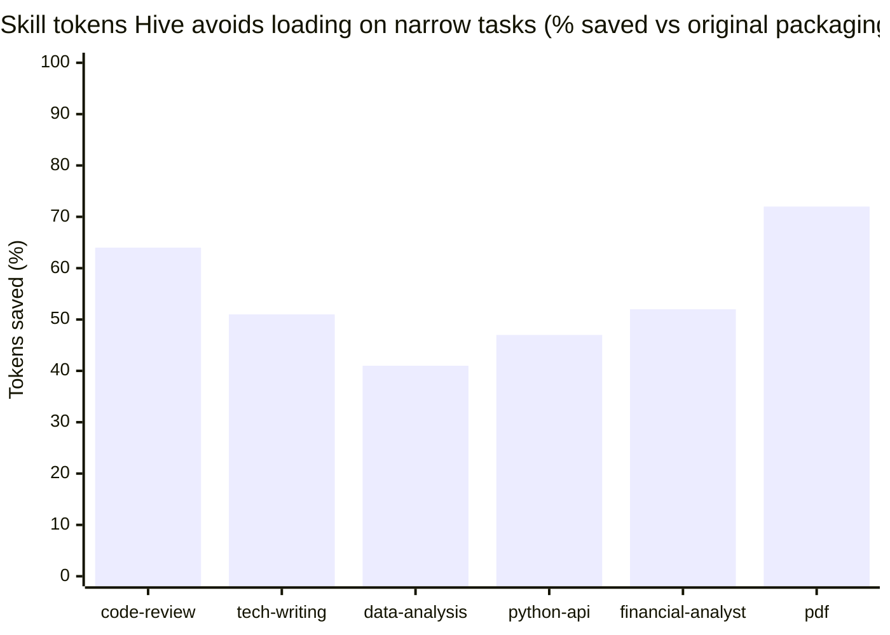

# CCS Benchmarks

This document consolidates every benchmark in this repository that bears on the
Compiled Composable Skills (CCS) framework. It covers seven experiments run under
one shared protocol, a summary of which framework claims each supports, a
reproduction guide, and honest limitations. Every number below was cross-checked
against the raw judge and token-accounting JSON; two small prose/raw
discrepancies are flagged inline.

All quality scores are the sum of four rubric dimensions (correctness,
completeness, expertise/best-practice, communication), each 1–10, for a maximum
of 40. "Rank" is the per-task placement among that task's conditions (1 = best).
"Skill tokens" is the deterministic cost of the skill files a worker loaded.

---

## 1. Methodology (shared protocol)

The same guardrails apply to every experiment; individual experiments only vary
the conditions being contrasted.

- **Frozen-tasks-by-commit contamination control.** Evaluation tasks are
  authored and committed *before* the skills (or skill conversions) they test
  exist. Skill authors and decomposers never see the tasks. This prevents
  tailoring in either direction: tasks cannot be written to a skill's
  strengths, and skills cannot be written to a task's needs.
- **Content-parity authoring.** In round 1, the monolithic and composable
  packagings of a skill were authored to carry *identical knowledge*; packaging
  was the only variable. Where a conversion later compressed content, that became
  a finding, not a silent confound (see Experiment 3).
- **Blind judging.** Worker outputs are stripped of condition labels, presented
  in randomized order, and scored by independent frontier-tier LLM judges against
  a fixed rubric. The label→output mapping is committed to a blinding file
  *before* judging (`benchmarks/exp1-2/scores/blinding*.json`,
  `benchmarks/exp3-4/blinding*.json`).
- **Deterministic token accounting.** Skill-token cost = characters ÷ 4 of every
  skill file the worker actually loaded, verified against the worker's
  self-reported `LOADED` line and against file sizes. Applied identically to all
  conditions.
- **Orchestrator verification.** The orchestrator re-executed code outputs
  against spec, recomputed analytical ground truth independently (e.g. the DCF:
  WACC 10.06%, EV ≈ $194,990, equity ≈ $205,490, $22.34/share), and confirmed
  zero fabricated `LOADED` claims. No judge scores were overridden in round 1.
- **Known noise band.** Single-run cells carry roughly **±1 rank / ~3 points**
  of judge noise. Independent re-judging of the same outputs shifted some
  rankings within this band (Experiment 2), which is why score *gaps ≤ 3* are
  treated as ties throughout.

### Token savings on narrow tasks, at a glance

The six narrow-task cells referenced most often in this document (from
Experiment 1's four authored domains, Experiment 3's financial-analyst
conversion, and Experiment 7's pdf skill), skill tokens loaded, original
packaging vs Hive selective loading:



Each bar is one skill's narrow-task benchmark cell: the percentage of skill
tokens Hive's selective loading avoided compared to loading the skill's
original packaging. The absolute numbers behind the bars:

| Skill | Original packaging (tokens) | Hive selective load (tokens) | Saved |
|---|---|---|---|
| code-review | 4,197 | 1,516 | 64% |
| tech-writing | 4,298 | 2,090 | 51% |
| data-analysis | 4,176 | 2,444 | 41% |
| python-api | 4,702 | 2,483 | 47% |
| financial-analyst | 4,833 | 2,299 | 52% |
| pdf | 14,309 | 3,995 | 72% |

Bars left to right in each pair: original/monolithic packaging, then Hive
selective loading. Source rows: code-review, tech-writing, data-analysis, and
python-api narrow are in the Experiment 1 table (section 2); financial-analyst
narrow is in the Experiment 3 table (section 4); pdf narrow is in the
Experiment 7 table (section 8). These are narrow-task cells only; the
broad-task rows in those same tables show the advantage shrinking or
inverting, for example Experiment 1's broad tasks run +2% to +27% over the
monolith, and Experiment 7's pdf-broad runs +55%.

---

## 2. Experiment 1: Monolithic vs Composable vs Baseline

**Design.** 4 domains (python-api, code-review, tech-writing, data-analysis) ×
2 task types (narrow, broad) × 3 conditions = 24 mid-tier LLM worker runs,
blind-judged by independent frontier-tier LLM judges. Conditions: **A** = no
skill; **B** = monolithic (read the full `SKILL.md`); **C** = composable (read
`INDEX.md`, self-select mini-skills, load only those, report which).

Raw: `benchmarks/exp1-2/scores/unblinded_results.json`,
`benchmarks/exp1-2/scores/token_accounting.json`.

| Task | A (none) | B (mono) | C (comp) | B tok | C tok | C vs B tok |
|------|----------|----------|----------|-------|-------|------------|
| python-api narrow | 37 (2) | 35 (3) | **38 (1)** | 4,702 | 2,483 | **−47%** |
| python-api broad | **38 (1)** | 37 (2) | 33 (3) | 4,702 | 3,702 | −21% |
| code-review narrow | 33 (2) | 29 (3) | **36 (1)** | 4,197 | 1,516 | **−64%** |
| code-review broad | **37 (1)** | 30 (3) | 35 (2) | 4,197 | 4,672 | +11% |
| tech-writing narrow | 36 (2) | **36 (1)** | 34 (3) | 4,298 | 2,090 | **−51%** |
| tech-writing broad | **39 (1)** | 32 (3) | 36 (2) | 4,298 | 4,371 | +2% |
| data-analysis narrow | 30 (3) | **35 (1)** | 31 (2) | 4,176 | 2,444 | **−41%** |
| data-analysis broad | 28 (3) | 31 (2) | **36 (1)** | 4,176 | 5,284 | +27% |
| **Mean** | 34.75 (1.88) | 33.12 (2.25) | **34.88 (1.88)** | 4,343 | 3,320 | **−24%** |

**Findings.**

- **Quality: composable ≥ monolithic.** C beat B on mean score (34.88 vs
  33.12), tied it on mean rank (1.88 vs 2.25, C better), won the head-to-head
  **5–3**, and won both the coding-domain means (35.5 vs 32.75) and non-coding
  means (34.25 vs 33.5).
- **Token efficiency is real but conditional.** Narrow-task savings were
  **41–64% (mean ~51%)** with equal-or-better narrow quality (C 34.75 vs B 33.75).
  On broad tasks the advantage **inverts** (+2% to +27% in 3 of 4 domains):
  loading the index plus nearly every mini as separate files costs more than one
  monolith when most of the skill is relevant.
- **Robustness: no broad-task collapse.** C beat B on broad quality (35.0 vs
  32.5) and won data-analysis broad outright. The predicted selection-error
  failure mode occurred exactly **once in 8 C-runs (12.5%)**: `da-n-C` skipped
  the `01-data-quality` mini and paid for it (ranked 2nd behind the monolith,
  which carried that guidance). Otherwise selection was expert-grade:
  `cr-n-C` loaded exactly {review-method, security}; `tw-n-C` loaded exactly
  {changelog, breaking-changes, style}; `tw-b-C` correctly pruned
  breaking-changes-migrations for greenfield docs.
- **The unasked-for finding: a strong baseline, and monoliths that hurt.** The
  no-skill baseline (34.75) statistically tied composable and **beat monolithic**,
  winning 3 of 4 broad tasks. Two implications: (a) a *ceiling effect*: for
  tasks well inside the model's competence, generic skill content adds little,
  earning its cost only on trap-dense work (both skill conditions crushed
  baseline on data-analysis broad, 36/31 vs 28, by catching planted data-quality
  and causal-inference traps); (b) *monolithic drag*: B's mean rank (2.25) was
  the worst of the three, consistent with context-rot / lost-in-the-middle;
  B fell up to 7 points below baseline (tech-writing broad 32 vs 39) while C
  never fell below B by more than 2 points.

> **Data-discrepancy flag (minor).** The round-1 write-up printed the mean C
> skill tokens as **3,358** and the mean reduction as **−23%**. The eight raw per-cell
> C values sum to a mean of **3,320.25**, giving **−24%**. The table above uses
> the raw-derived figures. The direction and magnitude are unaffected.

---

## 3. Experiment 2: Compiled bundle, 4-way rejudge (condition D)

**Design.** The 4 broad tasks were re-run under **condition D** = read a single
compiled `BUNDLE.md` (all minis concatenated in index order, boundaries and
headers preserved). Fresh frontier-tier LLM judges scored A/B/C/D blind, with new
randomization committed before judging (`benchmarks/exp1-2/scores/blinding4.json`).

Raw: `benchmarks/exp1-2/scores/unblinded_results4.json`. Bundle sizes measured directly from
`skills/authored/<domain>/composable/BUNDLE.md`.

| Task | A none | B mono | C minis | **D bundle** | D tok vs B |
|------|--------|--------|---------|--------------|------------|
| python-api broad | 33 (3) | 35 (1) | 30 (4) | 34 (2) | +9% |
| code-review broad | 38 (1) | 38 (2) | 31 (4) | 32 (3) | +8% |
| tech-writing broad | 36 (2) | 30 (4) | 34 (3) | **38 (1)** | +10% |
| data-analysis broad | 26 (4) | 28 (3) | 32 (2) | **36 (1)** | +22% |
| **Mean (rank)** | 33.25 (2.50) | 32.75 (2.50) | 31.75 (3.25) | **35.00 (1.75)** | **+12%** |

**Findings.**

- **D beats C on every broad task (4–0).** One compiled read strictly dominates
  loading N minis individually: better quality, one file op, zero selection risk,
  no per-file overhead. The coverage rule (below) is confirmed as the right
  runtime policy.
- **D has the best mean score and rank of all four conditions**, and is the only
  condition with two outright wins. Against the monolith it splits **2–2** (the
  python-api loss is by a single point), so the fair claim is "at least monolith
  quality, likely better", not dominance.
- **Cost:** the bundle runs **+8% to +22%** tokens vs the monolith (mean +12%),
  exactly the self-containment redundancy each self-standing mini restates. This
  is an authoring-time problem with a known fix (factor shared preamble into an
  always-loaded `00-core` the compiler dedups), not a framework limitation.
- **Noise caveat, made concrete.** Independent re-judging shifted several A/B/C
  rankings vs Experiment 1 (e.g. code-review monolith rose from 30 to 38),
  directly confirming the declared ±1-rank single-run noise band. D's mean edge
  (+2.25 over monolith) exceeds observed score-noise on 2 of 4 tasks: direction
  solid, magnitudes indicative.

**The resulting loading policy** (validated by Experiments 1–2):

```
read INDEX.md                       # ~200 tokens, always
k = relevant minis / total minis
if k < 0.6:  load the k minis individually   # narrow: 41–64% savings
else:        load BUNDLE.md (or a preset)    # broad: best quality, one read
very broad + decomposable: fan out narrow subagents (1–2 minis each)
```

---

## 4. Experiment 3: Market-skill conversion case study (financial-analyst)

**Design.** An existing third-party skill (`financial-analyst` from
`alirezarezvani/claude-skills`), a two-level progressive disclosure setup
(~1,800-token always-loaded `SKILL.md` + 4 coarse references of 728–2,503 tok, no
"load-when" hints, no core, no bundle), was converted to CCS by a frontier-tier LLM, blind to
the eval tasks, which were frozen by commit first. Two tasks: a **narrow**
liquidity/leverage ratio read and a **broad** full work-up with DCF. Conditions:
no skill, original packaging, CCS. Blind-judged, ground-truth-verified.

Raw: `benchmarks/exp3-4/token_accounting.json`, `benchmarks/exp3-4/blinding.json`,
`benchmarks/exp3-4/judge/fn.json` (narrow), `benchmarks/exp3-4/judge/fb.json`
(broad). For the broad task the CCS candidate is the compiled bundle.

| Task | No skill | Original packaging | CCS |
|------|----------|--------------------|-----|
| Narrow (liquidity/leverage) | 38 (2) · 0 | **39 (1)** · 4,833 | 35 (3) · **2,299 (−52%)** |
| Broad (full work-up + DCF) | 32 (3) · 0 | **37 (1)** · 9,317 | 34 (2) · **7,169 (−23%)** |

**Findings.**

1. **Token efficiency transferred as predicted:** −52% narrow (the original's
   heavyweight entry file is always paid; CCS loaded a 456-token index + exactly
   3 relevant minis, expertly selected), −23% broad (bundle vs loading
   everything).
2. **Quality did NOT transfer: original packaging won both tasks (+4, +3).**
   Root cause per orchestrator analysis: the conversion was **lossy**. The
   decomposer's word budgets forced ~30% compression of a dense ~7,000-word
   source, and the judges' deciding details (deferred-revenue-adjusted coverage,
   balance-sheet tie-outs, dense benchmark tables; the judge notes cite exactly
   these) live in the compressed tail. Where round 1 enforced strict content
   parity, composable matched or beat the monolith; the deficit here is
   compression, not packaging.
3. **The lossy-conversion lesson (framework amendment):** decomposition of an
   existing skill must be **repackaging, never summarization**. Mini count and
   size must expand to carry the source verbatim-equivalent (here ~18 minis, or
   450–700-word minis). Token savings must come only from *selection* and
   *dedup*, never content loss. A parity diff (source vs union-of-minis) should
   gate every conversion.
4. Baseline stayed strong on the narrow task (38/40, zero skill tokens),
   the same ceiling effect: the model already knows standard ratio analysis;
   skills earn their cost on the trap-dense broad task, where both skill
   conditions beat baseline.

---

## 5. Experiment 4: Per-mini model routing probe (condition E)

**Design.** The broad finance task was re-run as a routed fan-out: 3 shards each
loading only its minis (ratios → mid-tier, DCF → frontier-tier, forecast →
mid-tier) plus a mid-tier synthesizer loading the reporting mini. Blind 4-way
rejudge with fresh randomization (`benchmarks/exp3-4/blinding_fb4.json`,
`benchmarks/exp3-4/judge/fb4.json`).

| Condition | Score/40 (rank) | Cumulative skill tok | Max per-context tok |
|-----------|-----------------|----------------------|---------------------|
| B original packaging | **36 (1)** | 9,317 | 9,317 |
| E routed fan-out | 35 (2) | 9,770 | ~2,900 |
| D compiled bundle | 33 (3) | 7,169 | 7,169 |
| A no skill | 31 (4) | 0 | 0 |

**Findings.** Routing matched single-context quality within noise (35 vs 36)
while running the frontier-tier model only on the hardest shard. Every shard's
mini selection was expert; the judge verified all four candidates hit the exact
ground-truth DCF, so the frontier-tier shard's advantage could not express itself
here (ceiling effect again). Routing's real currency is (a) clean small
per-context loads (~2,900 vs
7–9k), (b) cost shaping (premium-model tokens only where skill metadata says
they pay), (c) wall-clock parallelism. Its costs: cumulative-token overhead
(core+index duplicated per shard → 9,770 total) and synthesis-coherence risk
(the judge explicitly checked cross-section consistency and found E coherent).
**Amendment:** minis MAY carry optional `model-hint`/`effort-hint` frontmatter;
the coverage rule gains a third branch: decomposable broad task + heterogeneous
shard difficulty → routed fan-out. (Thinking-budget routing is harness-dependent;
this harness exposes per-agent model but not thinking budget.)

---

## 6. Experiment 5: Skill-graph edge probe (requires:/pairs-with:)

**Design.** 5 dependency-trap tasks were frozen by commit first, each needing a
non-obvious mini (3 of 5 cross-skill). A frontier-tier LLM author then added 62
edges (17 cross-skill, 4 `requires`) across all 5 domains from domain logic
alone, blind to the tasks, plus `INDEX-E` variants rendering edges as hints. 10
paired mid-tier LLM workers ran each task twice: **flat** index
(frontmatter-stripped) vs **edge-annotated** index. Primary metric is objective:
did the worker's `LOADED` line include the pre-registered target mini?

Raw: `benchmarks/exp5/outputs/T{1..5}-{flat,edge}.md` `LOADED` lines (file counts
below recomputed directly from those lines).

| Task (target mini) | Flat | Edge | Files flat/edge |
|--------------------|------|------|-----------------|
| T1 aggregation (da/01-data-quality) | HIT | HIT | 6 / 6 |
| T2 URL-fetch endpoint (cr/02-security, cross) | HIT | HIT | 9 / 10 |
| T3 DCF on messy data (da/01-data-quality, cross) | HIT | HIT | 6 / 7 |
| T4 perf fix in threaded app (cr/04-concurrency) | HIT | HIT | 5 / 5 |
| T5 CFO forecast (fin/08 or 09, cross) | HIT | HIT | 8 / 11 |

**Findings.** **10/10 selection hits: the target mini was loaded in every
paired run, in both conditions.** Application was verified, not just loading:
both T3 workers caught the planted duplicate quarter and 10× revenue outlier
before deriving growth; both T4 fixes were lock-protected; both T2 endpoints
included SSRF protection. Verdict: **no measurable selection or application
benefit from edges at this scale** (5 domains, 59 minis, good one-line
"load-when" index descriptions, always-core present). Edges showed a mild
**precision cost**: edge workers loaded more files on 3 of 5 tasks (the pull-in
effect): T2 9→10, T3 6→7, T5 8→11. Cross-skill value came from cross-domain
*availability* (workers freely pulled the second domain's minis in both
conditions), not from edge metadata. The library-scale hypothesis for edges
remains a hypothesis; this run bounds it: with good descriptions and a capable
selector, flat indexes suffice well past single-domain scale.

> **Data-discrepancy flag (minor).** The round-2 write-up described the precision
> cost as edge workers loading "**12–37% more files**". The raw file counts give
> **+11%** (T2, 9→10), **+17%** (T3, 6→7), and **+38%** (T5, 8→11), i.e. the
> low end is ~11%, not 12%. Trivial rounding; the pull-in direction stands.

---

## 7. Experiment 6: Supplemental validation on official Anthropic skills

**Design.** Two skills published by Anthropic in `anthropics/skills` were
vendored unmodified (`skills/sources/anthropic/`, provenance and license retained) and
converted to CCS by the §8 lossless discipline, parity-verified against source
(the union of minis is content-equivalent; no compression). The two skills sit
at opposite ends of the size axis this framework cares about:
**mcp-builder** (~23k tokens of dense knowledge: MCP server craft, error
handling, pagination, Python *and* Node reference implementations, an eval
harness) and **internal-comms** (~2.8k tokens: a small `SKILL.md` + four short
examples). Four tasks were frozen by commit before the conversions existed (a
narrow and a broad task per skill), and each was run under three conditions:
**A** = no skill; **B** = the skill in its *original* Anthropic packaging, loaded
as-designed (progressive disclosure: read `SKILL.md`, then pull the reference
files the task warrants); **C** = the CCS conversion under the shipped
coverage-based loading policy (§10 of the spec: INDEX → 00-core → minis if
`k/N` < ~0.6, else the bundle/preset). Independent frontier-tier LLM judges
scored blind against the fixed rubric; for the two MCP tasks the judges also
**executed** each
candidate server (ran `server.py` against `mcp`+`pydantic` and exercised
pagination, detail levels, not-found, validation, version-conflict, and
simulated-failure paths), the strongest form of orchestrator verification in
this repository.

Raw: `benchmarks/exp6/tasks/*`, `benchmarks/exp6/unblinded_results.json`,
`benchmarks/exp6/token_accounting.json`, `benchmarks/exp6/blinding.json`,
`benchmarks/exp6/judge/*.json`. Every cell below was recomputed from the
per-dimension judge scores and the committed blinding map.

| Task | A (none) | B (original) | C (CCS) | B tok | C tok | C vs B tok |
|------|----------|--------------|---------|-------|-------|------------|
| mcp narrow | 34 (2) | 31 (3) | **36 (1)** | 10,381 | 9,200 | **−11%** |
| mcp broad | 34.5 (2) | **36 (1)** | 32.5 (3) | 15,797 | 24,067 | +52% |
| comms narrow | 31 (3) | **37 (1)** | 33 (2) | 529 | 687 | +30% |
| comms broad | **36 (1)** | 31 (2) | 29 (3) | 1,121 | 1,283 | +14% |

**Findings.**

1. **CCS wins the large-skill narrow task exactly as theory predicts.** On
   mcp-narrow, C had the best quality of the three (**36 vs 34 baseline vs 31
   original**) *and* cost **−11%** tokens versus the original packaging. This is
   the coverage rule's narrow path doing precisely its job on a genuinely large
   skill (~23k tokens of content): C read the INDEX, loaded `00-core` plus the handful
   of relevant minis (naming, response formats, error handling; 9 files,
   9,200 tok) and skipped the rest, while the original had to pull whole coarse
   reference files (`mcp_best_practices.md` + `python_mcp_server.md`, 10,381 tok)
   to reach the same guidance. Better quality at lower cost: the central CCS
   claim, reproduced on an official skill it did not author.

2. **The broad MCP task exposes the PRESET GAP: a real CCS loss, honestly.**
   On mcp-broad, coverage was high (`k/N` ≥ ~0.6), so the coverage rule sent the
   worker to `BUNDLE.md`, the *entire* skill, **24,067 tokens**, which includes
   the full Node/TypeScript implementation reference that a Python task never
   needs. The original-packaging worker, doing manual progressive disclosure,
   simply *skipped the Node reference* and loaded only `SKILL.md` +
   best-practices + `python_mcp_server.md` + `evaluation.md` (**15,797 tok**), a
   leaner, better-targeted load that also scored higher (**36 vs 32.5**). The
   bundle's all-or-nothing broad path lost to a human-designed disclosure tree
   that could prune half the skill. **Remedy applied post-benchmark:** compiled
   two language presets: `presets/python-server.md` (**11,302 tok**, which would
   have been **−28%** versus the original's 15,797) and `presets/node-server.md`,
   so the coverage rule's broad branch can select a language-scoped preset
   instead of the whole bundle. This fix was **not re-benchmarked**; its −28% is a
   deterministic token projection, not a measured quality result, and is reported
   as such. The lesson generalizes: when a skill's minis partition into
   mutually-exclusive tracks (Python vs Node), presets (not the monolithic
   bundle) are the correct broad-path target, and a skill that ships tracks
   *should* ship the matching presets.

3. **Small skills (< ~3k tokens) get no benefit from CCS: a new scope rule.**
   internal-comms is ~2.8k tokens total; there is almost nothing to select
   *among*. In both comms cells the original single-file packaging beat the CCS
   conversion (comms-narrow B 37 vs C 33; comms-broad B 31 vs C 29), and CCS was
   also *more* expensive, because the INDEX + always-loaded `00-core` overhead
   exceeded any selection savings (comms-narrow C 687 tok / 3 files vs original
   529 / 2 files; comms-broad C 1,283 vs 1,121). The scaffolding CCS adds only
   earns back its cost when there is a large body of knowledge to load
   *selectively* from. **New scope rule: CCS pays for a skill carrying above
   roughly 5k tokens of content; below that, a single `SKILL.md` is the right
   packaging**. Do not convert a small skill.

4. **Baseline won comms-broad: the ceiling effect again, with a fact-discipline
   twist.** The no-skill baseline took comms-broad outright (36, rank 1),
   consistent with the strong-baseline / ceiling effect seen throughout: internal
   communications is well inside model competence, so packaging generic writing
   guidance added cost without quality. Worse for the skill conditions, the judge
   notes record that *both* skill outputs committed fact-discipline slips the
   baseline avoided: the original-packaging output asserted an invented surplus
   rule ("you don't get to pocket the difference") that contradicted its own FAQ,
   and the CCS output invented the opposite rule ("if you spend less, you keep the
   difference") *and* softened "92% satisfaction" into "92% preferred it", the
   exact spin the task warned against. The baseline uniquely refused to attach the
   pilot's satisfaction data to an untested claim. On a task the model already
   handles well, loading skill content bought nothing and correlated with more
   confident invention.

**Net.** Experiment 6 reproduces the framework's central win on a large official
skill (mcp-narrow: better quality, −11% tokens) and, just as usefully, marks its
two boundaries honestly: the broad-task bundle can over-load versus hand-tuned
disclosure when a skill contains mutually-exclusive tracks (fixed with presets,
projected but not re-measured), and below ~5k tokens of knowledge the CCS
scaffolding costs more than it saves.

> **Preset-remedy caveat.** The `python-server`/`node-server` presets were
> compiled after judging and are **not** reflected in the mcp-broad row above.
> The 24,067-token C cell is the as-benchmarked bundle; the 11,302-token preset
> figure is a deterministic recompilation, offered as a design correction whose
> quality effect is untested.

---

## 8. Experiment 7: CCS's own converted skills, head-to-head with their original packaging

**Design.** Three Agent Skills that this repository ships in `skills/converted/`
were tested head-to-head against the *original* Anthropic packaging they were
converted from, on the skills' home turf. The three span two orders of magnitude
in size (measured from the vendored source `.md`): **claude-api** (~195k tokens,
the full multi-language SDK reference, 56 minis after conversion), **pdf** (~9k
tokens: form filling, extraction, generation) and **pptx** (~7k tokens: deck
creation and editing). Six tasks were frozen by commit before the conversions
were tested (a narrow and a broad task per skill), each run under three
conditions: **A** = no skill; **B** = the skill in its *original* Anthropic
packaging, loaded as designed (progressive disclosure: read `SKILL.md`, then pull
the reference files the task warrants); **C** = the CCS conversion under the
shipped coverage-based loading policy (§10 of the spec: INDEX → 00-core → minis if
`k/N` < ~0.6, else the bundle or a preset). 3 skills × 2 task types × 3 conditions
= 18 runs. Independent frontier-tier LLM judges scored blind against the fixed
rubric, grading accuracy against the vendored source docs as the ground truth.

Raw: `benchmarks/exp7/unblinded_results.json`,
`benchmarks/exp7/token_accounting.json`, `benchmarks/exp7/blinding.json`,
`benchmarks/exp7/judge/*.json`. Every cell below was recomputed from the
per-dimension judge scores and the committed blinding map.

| Task | A (none) | B (original) | C (CCS) | B tok | C tok | C vs B tok |
|------|----------|--------------|---------|-------|-------|------------|
| claude-api narrow | 29 (3) | **37 (1)** | 33 (2) | 30,189 | 31,655 | +5% |
| claude-api broad | 29 (3) | 34 (2) | **38 (1)** | 37,291 | 35,848 | **−4%** |
| pdf narrow | 29 (3) | **39 (1)** | 34 (2) | 14,309 | 3,995 | **−72%** |
| pdf broad | **35 (1)** | 34 (2) | 32 (3) | 6,558 | 10,149 | +55% |
| pptx narrow | 26 (3) | **37 (1)** | 36 (2) | 4,018 | 5,177 | +29% |
| pptx broad | 30 (3) | **36 (1)** | 34 (2) | 5,501 | 6,270 | +14% |
| **Mean (rank)** | 29.67 (2.67) | **36.17 (1.33)** | 34.50 (2.00) | 16,311 | 15,516 | **−5%** |

**Findings.**

1. **Skill knowledge dominates on domains outside model competence: the suite's
   clearest skills-beat-baseline result.** Both packagings beat the no-skill
   baseline by a wide margin on average (B 36.17 vs A 29.67, **+6.5 points**; C
   34.50 vs A 29.67, **+4.83 points**), the largest skill-vs-baseline gaps
   measured anywhere in these seven experiments. Per-cell the skill-over-baseline
   gaps run as high as **+10** (pdf-narrow, B 39 vs 29) and **+11** (pptx-narrow,
   B 37 vs 26). The reason is that current SDK details, live model IDs, and
   library-specific procedures are exactly the non-inferable knowledge a frontier
   model does not already carry, so packaging it pays where generic guidance did
   not in Experiments 1–6. (The one exception, pdf-broad, went to baseline by 1
   point over B and 3 over C, inside the noise band.) Loading-policy behavior was
   flawless: across the six C runs workers naturally exercised all three modes of
   the coverage rule with no missed target: **7 minis pulled from the 56-mini
   claude-api catalog** on the narrow task (INDEX + 00-core + six topic minis),
   the **full `BUNDLE.md`** on pdf-broad, and a **single preset read** on
   pptx-broad (`creating`) and claude-api-broad (`typescript`).

2. **CCS won the hardest cell, claude-api broad, at lower token cost.** The
   195k-token claude-api skill is the largest in the repository and cannot be
   loaded whole into any single context. On the broad task (a full multi-file
   TypeScript build) the CCS conversion took rank 1 outright, **38 vs 34 original
   vs 29 baseline**, while loading **fewer** tokens than the original packaging
   (35,848 vs 37,291, **−4%**) by reading the `typescript` preset plus one
   error-codes mini instead of the original's seven hand-pulled reference files.
   The judge specifically credited the winning output for current model IDs
   (opus-4-8 / sonnet-5 / haiku-4-5) with accurate 1M/200K contexts and pricing
   and doc-accurate streaming, parallel-tool, and typed-error handling; the
   original-packaging output ranked behind it partly for recommending stale model
   IDs and a hardcoded 200K context. CCS also posted the suite's largest token
   win on pdf-narrow: **−72% skill tokens (3,995 vs 14,309) at quality rank 2**,
   loading INDEX + 00-core + the single `forms` mini where the original pulled
   `SKILL.md`, two references, and eight scripts.

3. **The honest result: the original packaging won overall on these three
   skills.** Across the six tasks the original Anthropic packaging beat the CCS
   conversion on mean score (**36.17 vs 34.50**) and mean rank (**1.33 vs 2.00**),
   and took the head-to-head **4 wins to 1** (CCS's one win was claude-api broad;
   baseline took pdf-broad). Two of the original's four wins over CCS fall inside
   the ±3-point noise band (pptx-narrow +1, pptx-broad +2) and a third,
   claude-api-narrow (+4), sits just outside it; only **pdf-narrow (+5) is a
   decisive, real gap**, and the judge notes explain it: the original-packaging
   output was a near-verbatim reimplementation of the source `forms.md` workflow
   (structure-first extraction, FreeText-annotation fill, bounding-box
   validation), while the CCS output followed the same pipeline faithfully but
   deviated on the overlay technique. Interpretation: skills expressly hand-tuned
   for two-level progressive disclosure are a **strong baseline on their home
   turf**; converting them buys the loading economics (the −72% and −4% cells
   above), one uniform loading policy across every skill, per-skill versioning,
   and the lint/parity tooling, at **quality parity** (34.50 vs 36.17, a
   1.67-point mean gap inside the noise band) rather than quality gains. This is
   the sharpest contrast in the suite with Experiments 1–3, where CCS-style
   composition beat *monolithic* packagings outright: against a well-built
   progressive-disclosure tree on its own domain, the win is economic and
   operational, not qualitative.

**Net.** On skills whose knowledge lies genuinely outside model competence,
packaging that knowledge at all is worth roughly 5 to 7 points over no skill, the
largest such effect in the suite. Between the two packagings, Anthropic's
hand-tuned progressive disclosure holds a within-noise quality edge on its home
turf (36.17 vs 34.50, 4–1), while CCS matches it on quality and wins on economics
and scale: it made an un-loadable 195k-token skill navigable and took its hardest
cell at lower cost. Converting an already-well-packaged skill buys uniform
loading, versioning, and tooling at quality parity, not a quality bump; the
quality wins remain where Experiments 1–3 found them, against monolithic
packagings.

---

## 9. Summary: framework claims and their evidence

| Claim | Evidence | Effect size |
|-------|----------|-------------|
| Composable ≥ monolithic on quality | Exp 1 | +1.76 mean, 5–3 head-to-head, wins coding & non-coding |
| Big token savings on narrow tasks | Exp 1, Exp 3 | 41–64% (mean ~51%); 52% on the converted market skill |
| Token advantage inverts on broad tasks (packaging overhead) | Exp 1 | +2% to +27% vs monolith |
| Compiled bundle fixes the broad-task tradeoff | Exp 2 | D beats C 4–0; best mean rank (1.75); ≥ monolith quality |
| Bundle cost = self-containment redundancy only | Exp 2 | +8% to +22% tokens vs monolith (mean +12%) |
| Coverage rule (k/N ≈ 0.6) is the right runtime policy | Exp 1 + 2 | narrow→minis wins; broad→bundle wins, both confirmed |
| Expert-grade self-selection, low miss rate | Exp 1, 3, 5 | 1 miss in 8 (12.5%) round 1; 10/10 hits in edge probe |
| Always-core prevents the observed selection miss | Exp 1 diagnosis → Exp 3/5 design | da-n miss was a cross-cutting mini; core loaded in every later run |
| Strong-baseline / ceiling effect | Exp 1, 3, 4, 6 (counter-case Exp 7) | baseline ties composable, beats monolith on 3/4 broad tasks; wins comms-broad; but on knowledge outside model competence (Exp 7) both packagings crush baseline |
| Monolithic drag (context rot) | Exp 1 | B worst mean rank (2.25); up to −7 vs baseline |
| Conversions must be lossless (parity gate) | Exp 3 | lossy −30% compression cost the quality edge (+4/+3 to original) |
| Routing matches single-context quality, shapes cost | Exp 4 | 35 vs 36 (within noise); max context ~2,900 vs 9,317 |
| Edges not justified at domain scale | Exp 5 | no selection/application gain; mild precision cost |
| CCS narrow win transfers to a large official skill | Exp 6 | mcp-narrow: C best quality (36) *and* −11% tokens vs original |
| Bundle is all-or-nothing on broad tasks (preset gap) | Exp 6 | mcp-broad: bundle 24,067 tok / 32.5 lost to pruned disclosure 15,797 tok / 36; remedy = language presets (11,302 tok, −28% projected, not re-benchmarked) |
| CCS pays only above ~5k tok of knowledge | Exp 6 | small skill (~2.8k): index+core overhead > selection savings; original won both comms cells |
| Skill knowledge dominates outside model competence | Exp 7 | both packagings beat baseline (B +6.5, C +4.83 mean points); largest skill-vs-baseline gaps in the suite |
| CCS makes an un-loadable 195k skill navigable and wins its hardest cell | Exp 7 | claude-api broad: C 38 vs B 34 vs A 29 at −4% tokens; pdf-narrow −72% tokens at quality rank 2 |
| Hand-tuned disclosure holds parity-or-better on its home turf | Exp 7 | original won 4–1, mean 36.17 vs 34.50 (1.67, within noise); CCS's edge is economics, scale navigation, and uniform tooling, not quality |

---

## 10. Reproduction guide

**Experiment 1 (round-1 A/B/C).**
- Design, criteria & shared protocol: `benchmarks/exp1-2/protocol.md`.
- Tasks/fixtures: `benchmarks/exp1-2/tasks/`, `benchmarks/exp1-2/fixtures/`;
  worker outputs: `benchmarks/exp1-2/outputs/`.
- Scores: `benchmarks/exp1-2/scores/unblinded_results.json`; blinding map:
  `benchmarks/exp1-2/scores/blinding.json`; token accounting:
  `benchmarks/exp1-2/scores/token_accounting.json`.
- Skills under test: composable skills at `skills/authored/<domain>/composable/`;
  monolithic baselines at `benchmarks/exp1-2/monolithic-skills/<domain>/`.

**Experiment 2 (bundle rejudge, condition D).**
- Scores: `benchmarks/exp1-2/scores/unblinded_results4.json`; blinding:
  `benchmarks/exp1-2/scores/blinding4.json`; bundles:
  `skills/authored/<domain>/composable/BUNDLE.md`.

**Experiment 3 (market-skill conversion).**
- Provenance: `financial-analyst`, `alirezarezvani/claude-skills` (vendored under
  `skills/sources/`); converted skill: `skills/authored/financial-analysis/`.
- Tasks/fixtures: `benchmarks/exp3-4/tasks/`, `benchmarks/exp3-4/fixtures/`
  (e.g. `meridian_financials.json`).
- Scores: `benchmarks/exp3-4/judge/fn.json` (narrow),
  `benchmarks/exp3-4/judge/fb.json` (broad); blinding:
  `benchmarks/exp3-4/blinding.json`; tokens:
  `benchmarks/exp3-4/token_accounting.json`.

**Experiment 4 (routing probe, condition E).**
- Scores: `benchmarks/exp3-4/judge/fb4.json`; blinding:
  `benchmarks/exp3-4/blinding_fb4.json`; per-shard loads & tokens:
  `benchmarks/exp3-4/token_accounting.json` (`fb-E`).

**Experiment 5 (edge probe).**
- Paired outputs with `LOADED` lines:
  `benchmarks/exp5/outputs/T{1..5}-{flat,edge}.md`.
- Flat vs edge index variants: `benchmarks/exp5/skills-flat/…/INDEX.md` and
  `skills/authored/<domain>/composable/INDEX-E.md`.

**Experiment 6 (official-skill supplemental validation).**
- Provenance: `mcp-builder`, `internal-comms` from `anthropics/skills` (vendored
  unmodified under `skills/sources/anthropic/`, license + `PROVENANCE.md` retained);
  converted skills: `skills/converted/mcp-builder/`, `skills/converted/internal-comms/`.
- Frozen tasks: `benchmarks/exp6/tasks/{mcp,comms}-{narrow,broad}.md`; worker
  outputs: `benchmarks/exp6/outputs/`; blind inputs: `benchmarks/exp6/blind/`.
- Scores: `benchmarks/exp6/judge/{mcp,comms}-{n,b}.json`; blinding map:
  `benchmarks/exp6/blinding.json`; tokens: `benchmarks/exp6/token_accounting.json`;
  consolidated cells: `benchmarks/exp6/unblinded_results.json`.
- Post-benchmark preset remedy (not re-judged):
  `skills/converted/mcp-builder/composable/presets/{python-server,node-server}.md`.

**Experiment 7 (own-skill head-to-head vs original packaging).**
- Provenance: `claude-api`, `pdf`, `pptx` from `anthropics/skills` (vendored
  unmodified under `skills/sources/anthropic/`, license + `PROVENANCE.md` retained);
  CCS conversions: `skills/converted/{claude-api,pdf,pptx}/`.
- Frozen tasks: `benchmarks/exp7/tasks/{capi,pdf,pptx}-{narrow,broad}.md`; worker
  outputs: `benchmarks/exp7/outputs/`; blind inputs: `benchmarks/exp7/blind/`.
- Scores: `benchmarks/exp7/judge/{capi,pdf,pptx}-{n,b}.json`; blinding map:
  `benchmarks/exp7/blinding.json`; tokens: `benchmarks/exp7/token_accounting.json`;
  consolidated cells: `benchmarks/exp7/unblinded_results.json`.

The agentic meta-skill was separately exercised against this repository; that
adoption test and its report live under `benchmarks/adoption-test/`. Framework
rationale and amendments spanning all experiments are folded into each rule's
**Evidence** line in `docs/SPEC.md` and summarized in `README.md`.

---

## 11. Limitations

- **Single-run cells.** No repeated sampling; score gaps ≤ 3 are within judge
  noise. Mitigated (not eliminated) by many cells, blind judging, and
  orchestrator verification. Experiment 2's re-judge is direct evidence of the
  ±1-rank band. Experiment 6's twelve cells and Experiment 7's eighteen cells are
  likewise n=1.
- **One model family.** Mid-tier LLM workers, frontier-tier LLM judges/authors
  throughout (frontier-tier workers in Experiment 6). Results may not transfer to
  other model families or much weaker selectors.
- **Untested remedies.** The Experiment 6 preset fix (`python-server`/
  `node-server`) is a deterministic recompilation reported as a token projection
  (−28%); its quality effect was not re-benchmarked. It is a design correction,
  not a measured result.
- **chars/4 token approximation.** Applied identically to all conditions, so
  ratios are robust, but absolute token counts are estimates, not tokenizer-exact.
- **Self-reported LOADED.** Worker loading is self-reported; cross-checked
  against file sizes and found free of fabrication, but not sandbox-enforced.
- **Narrow domain coverage.** 4–5 authored domains plus 5 official skills
  (Experiment 6's mcp-builder and internal-comms; Experiment 7's claude-api, pdf,
  pptx). Most sit comfortably inside the model's competence, which produces the
  recurring ceiling effect: skills moved scores mainly on trap-dense,
  judgment-heavy tasks. Experiment 7's three skills are the exception, carrying
  current-SDK and file-tooling knowledge that sits largely *outside* model
  competence, which is why skills there beat baseline by the suite's widest
  margins. The framework's quality claims are strongest where content is
  trap-dense or genuinely external; its token claims are general.
- **Scope floor.** Experiment 6 bounds CCS from below: on a ~2.8k-token skill the
  index+core scaffolding cost more than selective loading saved. CCS is for
  a skill carrying above roughly 5k tokens of content; small skills should stay
  a single file.
- **Edges and routing under-tested.** The edge probe (n=5, one worker model,
  traps partly discoverable from index lines) *bounds* rather than settles the
  library-scale edge question; routing's quality gains could not express
  themselves under the observed ceiling effect.
