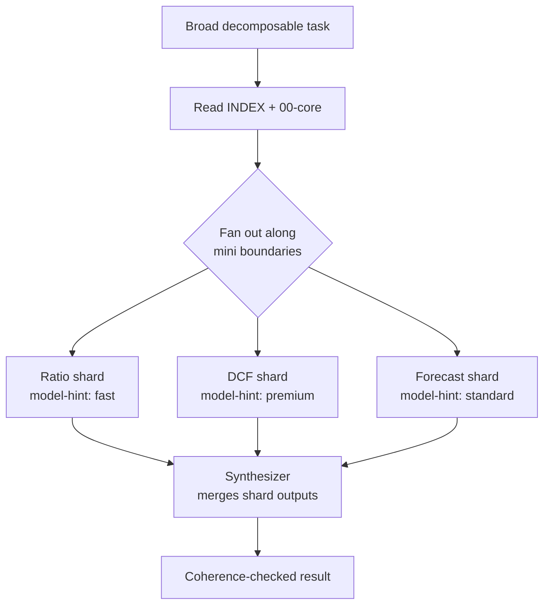

# Model and Effort Routing

A practical manual for routing a fanned-out Hive skill across models of
different capability. This is the operator's guide to the `model-hint` and
`effort-hint` frontmatter keys; the normative rules live in `docs/SPEC.md` §10.4
and §11.

## The idea

A monolithic skill forces one model to carry the whole job in one context. If
any part of the task is hard, you pick a strong model, and then that strong
model also handles the ratio arithmetic, the formatting, and the boilerplate
extraction. You pay premium rates on the easy work because it shares a context
with the hard work.

A Hive skill is already split into minis. That split gives you a second axis to
route on. Each mini can declare a hint about what should execute the shard that
loads it:

- `model-hint`: the capability tier the shard deserves.
- `effort-hint`: how much reasoning budget the shard deserves.

An orchestrator that fans a broad, decomposable task out along mini boundaries
(the third branch of the coverage rule) reads these hints and matches each shard
to the cheapest model that is strong enough. Premium models and high reasoning
budgets go only to the shards that ask for them; everything else runs on a fast
mid-tier model.

## Why this manages cost

Consider a financial work-up split into a ratio shard, a forecast shard, a
DCF/valuation shard, and a report-formatting synthesizer. The ratio and
formatting shards are mechanical. The DCF shard is the judgment-heavy one.

Use illustrative relative costs: premium tokens cost 5x mid-tier tokens.

Send the whole job to the frontier model as one monolithic context of ~9,300
tokens:

```
9,300 tokens x 5 = 46,500 cost units
```

Route it instead. Each shard carries only its own minis plus core, about 2,900
tokens per context, ~9,770 tokens cumulative. Only the DCF shard (2,900 tokens)
runs on the premium tier; the other ~6,870 tokens run mid-tier:

```
premium DCF shard:  2,900 x 5 = 14,500
mid-tier remainder: 6,870 x 1 =  6,870
                              --------
                               21,370 cost units
```

That is roughly 21,370 versus 46,500, a bit over half the cost, for the same
task. The saving is structural: you stopped paying the 5x premium on the ratio,
forecast, and formatting work that never needed it. The larger the cheap
fraction of the job, the more routing saves.

## Why this can improve fit

Cost is not the only lever. Routing also matches each shard to a model whose
strengths fit the shard:

- Speed-sensitive shards (formatting a report, extracting fields from a
  statement) go to a fast model. Latency drops and nothing of value is lost,
  because these shards are not where judgment lives.
- Judgment-heavy shards (valuation, security review) go to a strong model, which
  is exactly where a capability difference would show up if the task were hard
  enough to expose it.

There is a context benefit too. Each shard's context carries only its one or two
minis plus core, measured at about 2,900 tokens, instead of the whole skill.
A smaller, single-topic context is less exposed to context-rot and
lost-in-the-middle degradation than one context holding every mini at once.

## How to declare it

Add advisory keys to a mini's YAML frontmatter. Both are optional `MAY` keys.
Use tier names, never vendor model IDs, so a skill stays portable across
harnesses that expose different model line-ups.

```yaml
---
model-hint: premium      # capability tier:   fast | standard | premium
effort-hint: high        # reasoning budget:  low  | standard | high
requires:
  - 05-dcf-terminal-value-sensitivity.md
pairs-with:
  - 08-driver-based-forecasting-scenarios.md
---
```

A ratio or formatting mini would instead carry `model-hint: fast` and
`effort-hint: low`. Minis with no opinion simply omit both keys and inherit the
orchestrator's default tier.

The hints name tiers, not models. The orchestrator resolves a tier against
whatever models its harness actually exposes: a harness with three models maps
`fast`/`standard`/`premium` onto them directly; a harness with two models
collapses `standard` and `premium` onto its stronger option. The skill author
does not need to know the harness line-up, and a harness can add or swap models
without touching any skill.

Degradation is graceful because the hints are advisory. An orchestrator MAY
ignore them. A single-agent run that never fans out ignores them completely: it
reads the index, loads minis or the bundle by the coverage rule, and the
frontmatter is inert. Nothing breaks when the hints are unread; you just lose the
routing optimization.

## The evidence, stated honestly

Experiment 4 ran the broad finance task as a routed fan-out: three shards plus a
mid-tier synthesizer, with the frontier tier used only on the DCF shard.

What it showed:

- Routing matched single-context quality within noise (35 vs 36 of 40).
- Per-shard contexts were clean and small, about 2,900 tokens each, versus the
  7-9k of the single-context conditions.
- Premium tokens were spent only on the hard shard, which is the cost-shaping
  win demonstrated above.

What it did not show:

- A quality gain. On this task all candidates hit the exact ground-truth DCF, so
  the premium shard's capability advantage had no room to express itself
  (ceiling effect). The quality benefit of routing is unproven.
- A cumulative-token win. Fanning out duplicates core and the index into every
  shard, so cumulative load ran about 36% above the single-context bundle
  (9,770 vs 7,169 tokens). Routing shapes where tokens are spent; it does not
  reduce their total.

One real risk was checked, not assumed: synthesis coherence. Splitting a work-up
across shards can produce sections that disagree. The experiment's judge
explicitly checked cross-section consistency and found the synthesizer's output
coherent. Treat this as a risk you must verify per skill, not a solved problem.

**Evidence status:** Experiment 4 showed routing matches single-context quality
within noise and shapes cost by spending premium tokens only on the hard shard;
the quality gain from the premium shard is unproven (ceiling effect).

### When to use routing

- Broad tasks that decompose cleanly along mini boundaries.
- Heterogeneous shard difficulty, where one or two shards are genuinely harder
  than the rest.
- Cost-sensitive pipelines where paying premium rates on the easy shards is the
  waste you want to cut.

### When not to

- Narrow tasks (one or two minis): there is nothing to fan out.
- Uniform shard difficulty: if every shard wants the same tier, routing adds the
  ~36% duplication overhead and coherence risk for no cost or fit benefit.
- Single-agent harnesses with no fan-out: the hints are inert, so just load by
  the coverage rule.

## The routed fan-out flow


